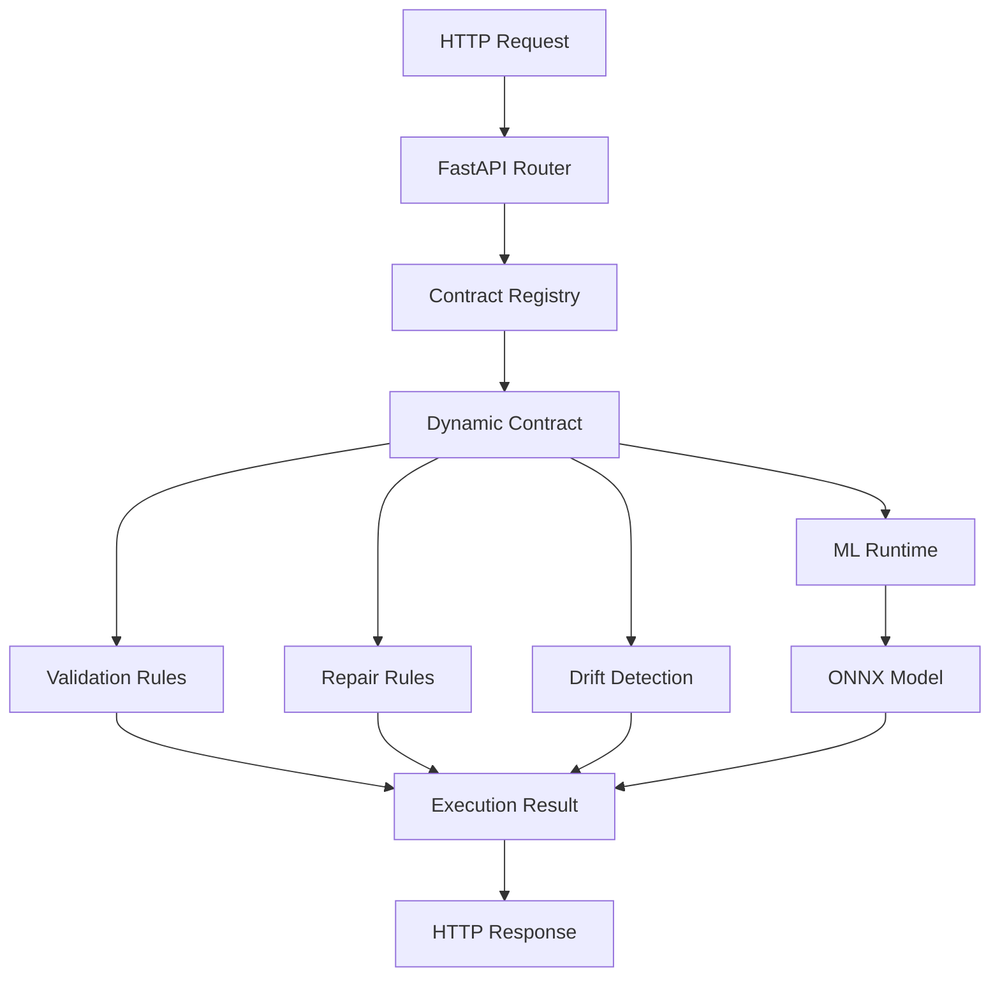

# ContractML

Runtime-executable Pydantic contracts for ML inference.

**Author:** Ankit Karki ([Ankit-x1](https://github.com/Ankit-x1))  
**Email:** karkiankit101@gmail.com  
**Repository:** https://github.com/Ankit-x1/ContractML

## Overview

ContractML loads versioned Pydantic contracts at runtime and executes them as first-class domain logic, including validation, repair, migration, and ML inference — without hardcoded schemas.

## Architecture



## Quick Start

### Installation

```bash
git clone https://github.com/Ankit-x1/ContractML.git
cd ContractML

python -m venv venv
source venv/bin/activate  
pip install -e ".[dev]"

#Test modes
python scripts/create_dummy_model.py
python scripts/create_fraud_model.py
```

### Run Server

```bash
uvicorn app.main:app --reload --host 0.0.0.0 --port 8000
```

### Make Prediction

```bash
curl -X POST "http://localhost:8000/predict/telemetry/v2" \
  -H "Content-Type: application/json" \
  -d '{
    "temp_c": 25.0,
    "humidity": 60.0
  }'
```

Response:
```json
{
  "status": "success",
  "domain": "telemetry", 
  "version": "v2",
  "data": {
    "temp_c": 25.0,
    "humidity": 60.0
  },
  "predictions": {
    "output": [0.85]
  },
  "metadata": {
    "drift_detected": false
  }
}
```

### Docker Deployment

```bash
docker build -t contractml .
docker run -p 8000:8000 contractml

#or
docker-compose up -d
```

## Contract Configuration

Contracts are defined in YAML under `schemas/`:

```yaml
domain: telemetry
version: v2
description: Enhanced telemetry with repair and drift detection

fields:
  temp_c:
    type: float
    min: -40
    max: 125
    repair: clamp
    drift:
      type: mean_shift
      expected_mean: 22.0
      threshold: 5.0
    description: Temperature in Celsius

  humidity:
    type: float
    min: 0
    max: 100
    repair: clamp
    default: 50.0

ml_model: models/telemetry/v2/model.onnx
```

## Features

- **Dynamic Schema Loading**: Runtime Pydantic model creation from YAML
- **Version Management**: Multiple contract versions simultaneously
- **Data Repair**: Automatic data cleaning and normalization
- **Drift Detection**: Statistical monitoring of input distributions
- **ML Integration**: ONNX model inference with automatic data preparation
- **Migration Support**: Schema evolution between versions

## Documentation

- [API Documentation](docs/API.md) - Complete API reference
- [Developer Guide](docs/DEVELOPER.md) - Architecture and development
- [Deployment Guide](docs/DEPLOYMENT.md) - Production deployment

## Development

### Setup

```bash
python -m venv venv
source venv/bin/activate  # Windows: venv\Scripts\activate
pip install -e ".[dev]"
```

### Testing

```bash
pytest

pytest --cov=app

pytest tests/test_integration.py::TestPerformance
```

### Code Quality

```bash
ruff check .
black .
mypy app/
```

### Contract Validation

```bash
python scripts/validate_contract.py
```

## API Endpoints

- `POST /predict/{domain}/{version}` - Execute contract with ML inference
- `GET /health` - Service health check

## Performance

- **Latency**: <10ms for validation + inference
- **Throughput**: 1000+ requests/second
- **Memory**: <50MB baseline

## License

Apache License 2.0

---

**ContractML** - Runtime-executable Pydantic contracts for ML inference  
Created by [Ankit Karki](https://github.com/Ankit-x1) | karkiankit101@gmail.com